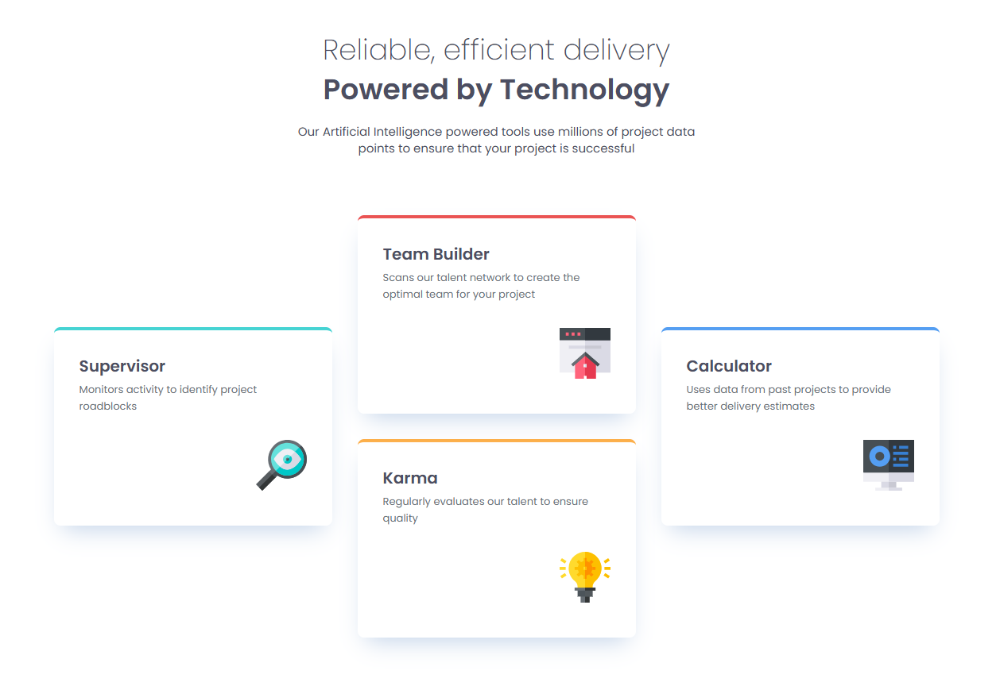

# Frontend Mentor - Four card feature section solution

This is a solution to the [Four card feature section challenge on Frontend Mentor](https://www.frontendmentor.io/challenges/four-card-feature-section-weK1eFYK). Frontend Mentor challenges help you improve your coding skills by building realistic projects. 

## Table of contents

- [Overview](#overview)
  - [The challenge](#the-challenge)
  - [Screenshot](#screenshot)
  - [Links](#links)
- [My process](#my-process)
  - [Built with](#built-with)
  - [What I learned](#what-i-learned)
- [Author](#author)

**Note: Delete this note and update the table of contents based on what sections you keep.**

## Overview

### The challenge

Users should be able to:

- View the optimal layout for the site depending on their device's screen size

### Screenshot



### Links

- Solution URL: [solution URL](https://github.com/Vilodya/four-card-feature-section-master)
- Live Site URL: [live site](https://vilodya.github.io/four-card-feature-section-master/)

## My process

### Built with

- Semantic HTML5 markup
- CSS custom properties
- Flexbox
- CSS Grid
- Mobile-first workflow

### What I learned

I improved my knowledge of clamp() and built the layout almost without media queries. Also, I refreshed my understanding of CSS Grid.


```css
@media (min-width: 768px) and (max-width: 1023.98px) {
  .features__grid {
    grid-template-columns: repeat(2, 1fr);
    grid-template-rows: repeat(3, auto);
  }

  .card--supervisor,
  .card--calculator {
    grid-column: 1 / -1;
  }
}

@media (min-width: 1024px) {
  .features__grid {
    grid-template-columns: repeat(3, 1fr);
    grid-template-rows: repeat(2, auto);
  }

  .card--supervisor {
    grid-row: 1 / -1;
    align-self: center;
  }

  .card--calculator {
    grid-column: -2 / -1;
    grid-row: 1 / -1;
    align-self: center;
  }
}
```

## Author

- Website - [LinkedIn](https://www.linkedin.com/in/vladimir--denisov)
- Frontend Mentor - [@Vilodya](https://www.frontendmentor.io/profile/Vilodya)
